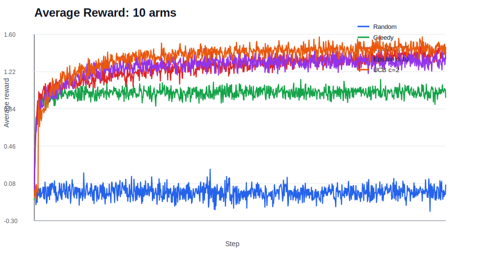
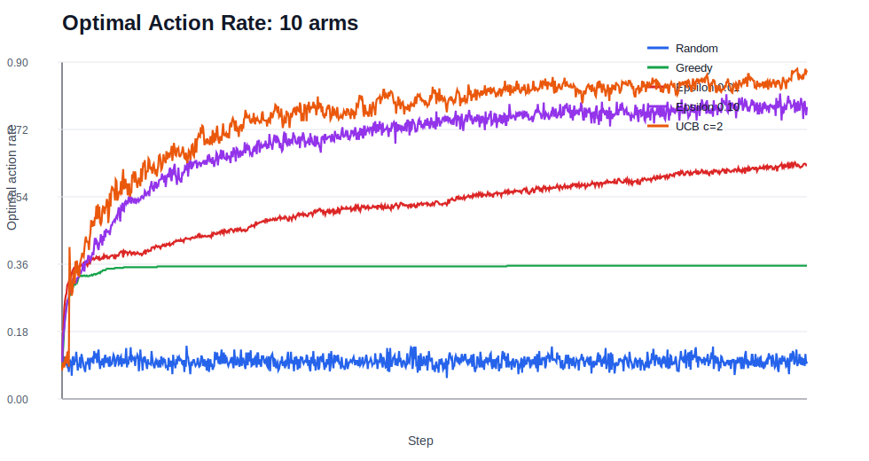

# Adaptive Decision Optimization Engine

Recruiter-ready reinforcement learning project exploring exploration vs exploitation in stationary Gaussian multi-armed bandits.

This repository is a cleaned, independent portfolio project based on sequential decision optimisation. It does not include private briefs, answer sheets, grading feedback, submission files, training material or restricted source material.

## Problem Statement

A multi-armed bandit represents a repeated decision problem: an agent must choose between several actions with unknown reward distributions. The agent has to balance:

- exploration: trying uncertain actions to learn more,
- exploitation: choosing the action that currently appears best.

This project compares common action-selection strategies across 5-arm, 10-arm and 20-arm Gaussian bandit testbeds.

## Why It Matters

Bandit methods are a foundation for reinforcement learning and online decision-making. The same exploration-exploitation trade-off appears in recommendation systems, online experiments, pricing, content ranking and adaptive optimisation.

## Methods

The simulation uses a stationary n-armed Gaussian testbed:

- true action values are sampled from `N(0, 1)` at the start of each run,
- rewards are sampled from `N(q*(a), 1)` when an arm is selected,
- action-value estimates are updated using the sample-average method,
- results are averaged across many independent runs.

## Policies Compared

| Policy | Description |
|---|---|
| Random | Selects an arm uniformly at random. |
| Greedy | Always selects the arm with the highest current estimated value. |
| Epsilon 0.01 | Explores randomly 1% of the time, otherwise exploits. |
| Epsilon 0.10 | Explores randomly 10% of the time, otherwise exploits. |
| UCB c=2 | Uses an upper-confidence-bound bonus to favour uncertain actions. |

## Experiment Setup

| Setting | Value |
|---|---:|
| Random seed | 42 |
| Arms tested | 5, 10, 20 |
| Runs per setting | 500 |
| Steps per run | 1,000 |
| Reward distribution | Gaussian |
| Reward standard deviation | 1.0 |
| Evaluation window | Final 100 steps |

The project uses the classic Sutton and Barto-style setup with epsilon-greedy policies and average reward / optimal-action plots. This portfolio version keeps that core idea, cleans the implementation and adds a UCB baseline.

## Results

Summary metrics are calculated over the final 100 steps of each experiment.

| Arms | Best policy by final reward | Final-window average reward | Final-window optimal-action rate |
|---:|---|---:|---:|
| 5 | UCB c=2 | 1.1137 | 0.8887 |
| 10 | UCB c=2 | 1.4598 | 0.8494 |
| 20 | UCB c=2 | 1.7568 | 0.8016 |

Full metrics are in [`results/summary_metrics.csv`](results/summary_metrics.csv).

## Visual Results

Average reward and optimal-action-rate plots are generated directly from the current simulation code.

| 10-arm average reward | 10-arm optimal action rate |
|---|---|
|  |  |

Additional plots are available for 5-arm and 20-arm settings in the `results/` folder.

## Key Findings

- Random selection performs poorly because it does not use reward feedback.
- Greedy selection can get stuck early because it exploits incomplete estimates.
- Epsilon-greedy improves learning by reserving some actions for exploration.
- Higher exploration helped more as the number of arms increased.
- UCB performed strongest in this run because it systematically explored uncertain arms before converging.

## Limitations

- The environment is stationary and simulated, so it is simpler than real online decision systems.
- Rewards are Gaussian with fixed variance; other reward distributions may change policy behaviour.
- Hyperparameters were not exhaustively tuned.
- Results are seed-dependent, although averaged across many runs.
- No contextual information is included; this is not a contextual bandit.

## Future Improvements

- Add Thompson sampling.
- Add non-stationary bandit experiments.
- Add contextual bandits with user/item features.
- Add regret curves.
- Add confidence intervals across runs.
- Package the simulation as a small interactive dashboard.

## How To Run

Create an environment and install dependencies:

```bash
python -m venv .venv
.venv\Scripts\activate
pip install -r requirements.txt
```

Run the full experiment:

```bash
python src/experiment.py --arms 5 10 20 --steps 1000 --runs 500 --output-dir results
```

Summarise the best policy per arm setting:

```bash
python src/summarise_results.py
```

## Repository Structure

```text
adaptive-decision-optimization-engine/
  README.md
  requirements.txt
  src/
    agents.py
    bandits.py
    experiment.py
    plotting.py
    summarise_results.py
  notebooks/
    README.md
  reports/
    experiment_card.md
  results/
    summary_metrics.csv
    *_average_reward.svg
    *_optimal_action_rate.svg
```

## Portfolio Note

This is written as an independent reinforcement learning portfolio project. It is safe to share publicly and does not expose private review material or restricted source files.
